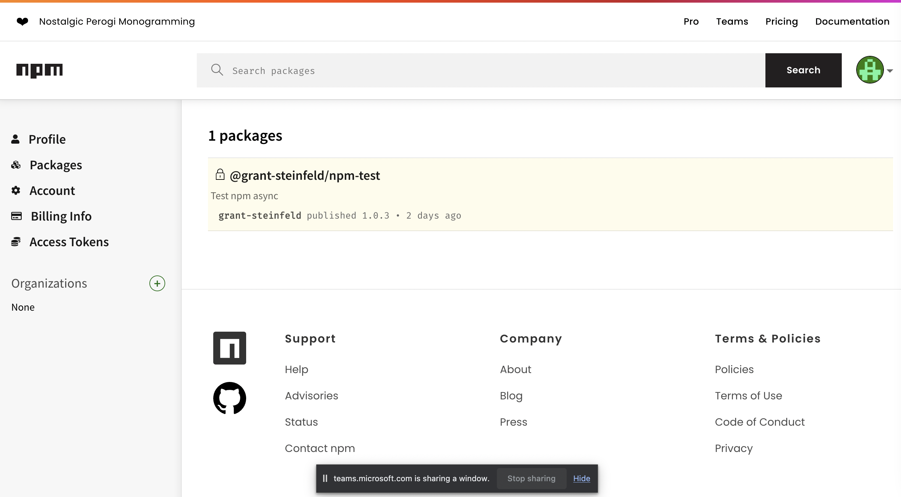

# Creating a npm lib, that makes async calls

## in this case we will use the npm requests lib, and alt to GOT or Axios

this article helps one understand how a promise is returned from an NPM library

https://www.geeksforgeeks.org/how-to-export-promises-from-one-module-to-another-module-node-js/

I published to the public npm registry with

```bash

npm login
# ... with 2fa Authenticator app
npm publish

# publishes to my user on public NPM
```

I pay the $7/month package as it gives me private scoped libraries, rather than just public



Here is how it looks on the public NPM registry ( only I can see it when logged in as it's scoped user/private )
